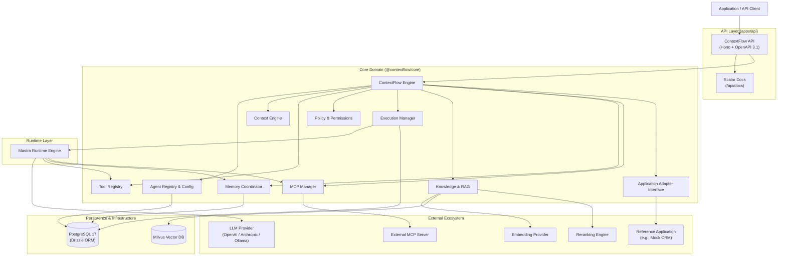
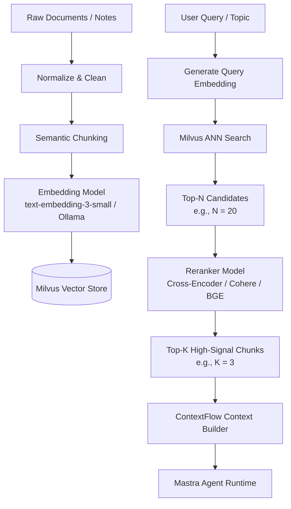

# ContextFlow V1 — System Architecture

> **Document Status**: Draft / Frozen for V1 Development  
> **Target Release**: V1 Proof-of-Concept  
> **Current Repository Phase**: Phase 0 (Foundation) completed; Phase 1 (AI & Context Layer) pending  
> **Audience**: Senior TypeScript Engineers, Systems Reviewers, Contributors, and Maintainers  

---

## 1. Context & Product Vision

**ContextFlow** is an independent, application-agnostic AI agent execution and context layer.

Modern software architectures frequently require AI agent capabilities: multi-step reasoning, external tool invocation, contextual grounding from internal databases, conversational memory, external protocol integrations (such as the Model Context Protocol, MCP), execution limits, and observability. However, building these capabilities ad-hoc inside every application creates tight coupling, duplicated infrastructure, and poor governance.

> **Core Value Proposition**:  
> ContextFlow enables applications to define and execute AI agents with controlled tools, application context, knowledge retrieval, memory, external MCP capabilities, policies, execution limits, and observability.

### What ContextFlow Is NOT
* **ContextFlow is NOT a CRM.** A CRM (or any other domain system) is merely a *reference application/adapter* used to demonstrate and validate how ContextFlow connects to an existing business system.
* **ContextFlow core contains NO domain-specific entities.** Concepts like `Contact`, `Deal`, `Lead`, `Company`, or `Ticket` belong strictly to external applications or adapters, never to ContextFlow core.

---

## 2. V1 Goal

The primary goal of V1 is to deliver a functional, production-shaped proof of concept that demonstrates the end-to-end execution path:

```text
Application
    ↓
ContextFlow
    ↓
Agent
    ↓
Context
    ├── Application data
    ├── Knowledge / RAG
    ├── Memory
    └── Instructions
    ↓
Tools / MCP
    ↓
External systems
```

### V1 Target Capabilities
1. **Define multiple agents** with independent configurations (instructions, models, tools, knowledge sources, limits).
2. **Execute agents** deterministically via a robust runtime abstraction.
3. **Inject application context** dynamically without leaking business domain models into the core.
4. **Retrieve knowledge via RAG** over vector embeddings.
5. **Rerank retrieved chunks** to optimize semantic relevance before passing context to LLMs.
6. **Maintain conversation memory** across turns and execution threads.
7. **Execute controlled tools** with strict input validation and least-privilege policies.
8. **Connect external MCP capabilities** using standard protocol clients.
9. **Enforce permissions and policies** before tool execution.
10. **Enforce execution limits** (maximum steps, maximum tool calls, wall-clock timeouts).
11. **Persist execution history and step traces** for auditability.
12. **Provide structured observability** into agent decisions, tool invocations, and retrieval performance.
13. **Operate independently of any specific host application**.
14. **Integrate with a reference application** via a clean adapter contract.

---

## 3. V1 Runtime Decision: Mastra

For V1, ContextFlow adopts **Mastra** as the underlying agent execution runtime.

This is an intentional architectural decision:
* ContextFlow is **not** attempting to reinvent an agent graph engine, workflow runner, tool execution engine, memory layer, MCP client, or LLM provider interface.
* Building commodity agent infrastructure distracts from ContextFlow’s true focus: **application-agnostic context assembly, policy enforcement, tool governance, and application adapters**.
* By leveraging Mastra for runtime primitives, ContextFlow accelerates time-to-value for V1 while maintaining clean architectural boundaries.

---

## 4. Core Architectural Principle: Build the Application, Not the Infrastructure

> **"Build the application, not the infrastructure."**

ContextFlow composes battle-tested, established technologies rather than reproducing them:

| Responsibility Layer | Owner | Technology |
|---|---|---|
| **Agent Configuration** | ContextFlow | `@contextflow/core` |
| **Context Engineering & Assembly** | ContextFlow | `@contextflow/core` |
| **Tool Registry & Governance** | ContextFlow | `@contextflow/core` |
| **Application Adapters & Context Providers** | ContextFlow | `@contextflow/core` |
| **Policies & Permissions** | ContextFlow | `@contextflow/core` |
| **Execution Metadata & History** | ContextFlow | `@contextflow/core` + PostgreSQL |
| **Public Product API** | ContextFlow | `@contextflow/api` (Hono + OpenAPI 3.1) |
| **Agent Runtime Primitives** | Infrastructure / Framework | Mastra |
| **Vector Database & Similarity Search** | Infrastructure | Milvus |
| **Relational Storage & Migrations** | Infrastructure / Tooling | PostgreSQL 17 + Drizzle ORM |
| **Protocol Integration** | Infrastructure / Standard | Model Context Protocol (MCP SDK) |
| **LLM Communication** | Infrastructure / Provider | Model Provider API via Mastra |
| **Embedding Generation** | Infrastructure / Provider | Embedding Provider (Ollama / OpenAI) |
| **Semantic Reranking** | Infrastructure / Provider | Reranker (Cohere / BGE / Local) |

### Why This Matters for V1
Attempting to author custom agent loops, vector storage, and memory stores simultaneously leads to brittle code, endless plumbing, and delayed delivery. Composing mature tools allows us to focus entirely on **what makes ContextFlow unique**: context synthesis, policy enforcement, and application integration.

---

## 5. V1 Technology Stack

```text
Application Runtime:       Bun (v1.3+)
Language:                  TypeScript (Strict Mode)
HTTP Framework:            Hono (v4.x)
Validation & Contracts:    Zod (v4.x)
API Contract:              OpenAPI 3.1.0 (@hono/zod-openapi)
Interactive API Docs:      Scalar (@scalar/hono-api-reference)
Relational Database:       PostgreSQL 17 (Alpine)
ORM & Migrations:          Drizzle ORM + Drizzle Kit
Agent Runtime:             Mastra
Vector Database:           Milvus (v2.x)
External Protocol:         Model Context Protocol (MCP TypeScript SDK)
Testing Framework:         Vitest (v5.x)
Linter & Formatter:        Biome (v2.5+)
Container Infrastructure:  Docker Compose
Local Model Inference:     Ollama (Optional for local offline development)
```

---

## 6. High-Level Architecture Diagram



---

## 7. Public API Boundary

ContextFlow strictly owns its public API contract.

### Base Path
All public API endpoints are served under:
```text
/api
```
> **Rule**: Do **NOT** use `/api/v1` for V1. URL-based versioning is premature and unnecessary for this phase.

### Current Phase 0 Endpoints (Implemented)
* `GET /api/health` — Liveness and system health check.
* `GET /api/openapi.json` — OpenAPI 3.1.0 specification document.
* `GET /api/docs` — Scalar interactive API reference.

### Target V1 Resource Groups (Conceptual Design)
The following resource paths represent the planned V1 API surface:
* `/api/agents` — Manage and inspect agent configurations.
* `/api/executions` — Trigger, inspect, and cancel agent executions.
* `/api/threads` — Conversational threads and conversation history.
* `/api/tools` — Tool registry inspection and capability definitions.
* `/api/knowledge` — Knowledge sources, document uploads, and ingestion triggers.
* `/api/mcp` — Registered MCP servers and tool discovery.

> [!NOTE]
> Resource groups beyond `/api/health`, `/api/openapi.json`, and `/api/docs` are **planned targets** and are not yet implemented in the codebase.

---

## 8. OpenAPI Contract & Scalar Documentation

ContextFlow treats API specifications as single sources of truth generated directly from code:

```text
Zod Schemas (Types & Runtime Validation)
        ↓
Hono OpenAPI (@hono/zod-openapi)
        ↓
OpenAPI 3.1 Specification (/api/openapi.json)
        ↓
Scalar Interactive Documentation (/api/docs)
```

### Critical Separation: ContextFlow API vs. Mastra Internal API
* **Public Contract**: The ContextFlow API is the client-facing gateway. It defines the stable contract for client applications, adapters, and consumers.
* **Internal Runtime**: Mastra exposes its own internal development server and OpenAPI/Swagger tools. In ContextFlow, Mastra’s internal API is strictly an **internal implementation detail**, never exposed as ContextFlow’s public API contract.

This guarantees that ContextFlow can evolve, wrap, replace, or customize runtime behavior without breaking downstream client contracts.

---

## 9. Agent Model

In V1, an **Agent** is a declarative configuration entity stored in ContextFlow.

```typescript
/**
 * Conceptual V1 Agent Configuration
 * Stored in PostgreSQL and loaded at execution time.
 */
export type AgentConfig = {
  id: string;
  name: string;
  description?: string;
  instructions: string;

  model: {
    provider: string; // e.g., "openai", "anthropic", "ollama"
    model: string;    // e.g., "gpt-4o", "claude-3-7-sonnet", "llama3.2"
  };

  tools: string[]; // Tool IDs referencing the Tool Registry

  knowledgeSources: string[]; // Knowledge Source IDs referencing RAG collections

  memory: {
    enabled: boolean;
    maxContextTokens?: number;
  };

  limits: {
    maxSteps: number;
    maxToolCalls: number;
    timeoutMs: number;
  };

  policies: string[]; // Policy identifiers applied to this agent
};
```

### Agent Model Boundaries
* An agent defines *what it is allowed to do*, *what instructions it obeys*, *what models it calls*, and *what capabilities it accesses*.
* An agent **never** receives direct database connection strings, credentials, or unrestrained system access.

---

## 10. Agent Execution Model

Execution is a first-class citizen in ContextFlow. Every agent invocation creates an auditable, tracked execution lifecycle.

### Execution Lifecycle Flow

```text
Client Request (User Prompt + Context Metadata)
       ↓
Resolve Agent Configuration (PostgreSQL / Cache)
       ↓
Create Execution Record (status: "running")
       ↓
Build Context (Instructions + Memory + App Context + RAG)
       ↓
Dispatch to Mastra Agent Runtime
       ↓
Runtime Step Loop (Model Calls ↔ Tool Executions ↔ MCP Invocations)
       ↓
Capture Final Output / Errors
       ↓
Persist Execution & Step Traces (status: "completed" | "failed" | "cancelled")
       ↓
Return Response to Client
```

### Target Execution Entity Structure

```typescript
export type ExecutionStatus = "running" | "completed" | "failed" | "cancelled";

export type ExecutionRecord = {
  executionId: string;
  agentId: string;
  tenantId: string;
  userId: string;
  status: ExecutionStatus;
  input: {
    prompt: string;
    contextOverrides?: Record<string, unknown>;
  };
  output?: {
    response: string;
    usage?: {
      promptTokens: number;
      completionTokens: number;
      totalTokens: number;
    };
  };
  error?: {
    code: string;
    message: string;
  };
  startedAt: string;
  completedAt?: string;
};
```

---

## 11. Execution Steps & Tracing

To prevent opaque "black-box" agent executions, ContextFlow records distinct step types within every execution.

### Step Types
* `model` — LLM prompt dispatch and generation.
* `retrieval` — Vector query and candidate extraction from Milvus.
* `reranking` — Score recalculation via the reranking engine.
* `tool` — Execution of registered tools via application adapters.
* `mcp` — Execution of remote tools over Model Context Protocol servers.
* `memory` — Reading or updating conversation history.

```text
Execution (executionId: "exec_1001")
│
├── 1. Memory Retrieval       (Loaded previous 4 messages)
├── 2. Knowledge Retrieval    (Extracted 10 candidate chunks from Milvus)
├── 3. Reranking              (Reranked to top 3 relevant chunks)
├── 4. Initial Model Call     (LLM decided to call "search_deals")
├── 5. Tool Call              (Executed search_deals via Application Adapter)
├── 6. Second Model Call      (LLM generated final response)
└── 7. Persist Memory & Trace (Marked execution as "completed")
```

ContextFlow maintains execution metadata in PostgreSQL for product-level queries, while delegating low-level runtime span traces to Mastra’s telemetry hooks.

---

## 12. Context Engine

The **Context Engine** is one of ContextFlow’s primary architectural differentiators. It synthesizes heterogeneous data streams into a unified, high-signal prompt context for the agent.

### Context Composition Formula

$$\text{Context} = \text{Instructions} + \text{User Request} + \text{Memory} + \text{Application Context} + \text{Retrieved Knowledge} + \text{Tool Results}$$

```text
User Input
     +
Agent Config (Instructions + Persona)
     +
Application Context (Live entity records from host application)
     +
Conversation Memory (Recent messages + summaries)
     +
RAG Context (Top-K reranked knowledge chunks)
     ↓
┌──────────────────────────────────────────────┐
│           ContextFlow Context Builder        │
│  - Token Budget Allocation                   │
│  - Deduplication & Formatting                │
│  - Prompt Structuring                        │
└──────────────────────────────────────────────┘
     ↓
Mastra Agent Runtime
```

---

## 13. Application Context

ContextFlow operates independently of any specific business domain. It interacts with host applications through generic, parameter-driven abstractions.

### Core Context Interfaces

```typescript
export type RequestContext = {
  tenantId: string;
  userId: string;
  agentId: string;
  executionId: string;
};

export interface ContextProvider {
  /**
   * Search host application entities matching a query string.
   */
  search(query: string, context: RequestContext): Promise<unknown[]>;

  /**
   * Retrieve a specific domain entity by type and identifier.
   */
  getEntity(type: string, id: string, context: RequestContext): Promise<unknown>;
}
```

### Domain Agnosticism
ContextFlow core has zero hardcoded knowledge of CRM, ERP, or CMS schemas. Whether the application manages contacts, patients, warehouses, or git repositories, ContextFlow treats entities as typed payloads governed by the `ContextProvider`.

---

## 14. Application Adapter Architecture

Host systems connect to ContextFlow through an adapter pattern:

```text
ContextFlow Core Domain
          │
          ├── MockApplicationAdapter (Used for local integration tests)
          ├── CRMAdapter (Reference implementation for demos)
          └── FutureApplicationAdapters (ERP, Helpdesk, Billing, etc.)
```

```typescript
export interface ApplicationAdapter extends ContextProvider {
  name: string;
  version: string;

  /**
   * Execute a state-changing action in the host application.
   */
  executeAction(
    actionName: string,
    params: Record<string, unknown>,
    context: RequestContext
  ): Promise<unknown>;
}
```

> **The Golden Boundary**: ContextFlow must never connect directly to a reference application's internal database. All communication flows through the `ApplicationAdapter` interface or HTTP/RPC boundaries.

---

## 15. Reference Application (Demo CRM)

To validate the architecture, V1 includes a mock reference CRM application.

### Reference Domain Entities
The reference application defines:
* `Company`
* `Contact`
* `Deal`
* `Activity`
* `Task`
* `Note`

> [!IMPORTANT]
> These entities are **strictly reference application concepts**. They exist solely to prove that an agent can research deals, inspect activities, and draft tasks through the `CRMAdapter`. They must never be imported into `@contextflow/core`.

---

## 16. Tool Architecture & Registry

Tools are the action boundary for agents.

### Tool Execution Flow

```text
Agent (Reasoning Loop)
       ↓ Emits Tool Call Request
Tool Registry (Resolves Tool ID & Validates Permissions)
       ↓
Policy Check (Validates Tenant, Role, and Execution Limits)
       ↓
Application Adapter / External API (Executes Function)
       ↓
Structured Output Returned to Agent
```

### Tool Definition Contract

```typescript
import { z } from "zod";

export type ToolDefinition<TInput = unknown, TOutput = unknown> = {
  id: string;
  name: string;
  description: string;
  inputSchema: z.ZodType<TInput>;
  requiredPermissions: string[];
  execute: (input: TInput, context: RequestContext) => Promise<TOutput>;
};
```

### Tool Registry Interface

```typescript
export interface ToolRegistry {
  register(tool: ToolDefinition): void;
  get(toolId: string): ToolDefinition | undefined;
  list(): ToolDefinition[];
  resolve(toolIds: string[], context: RequestContext): ToolDefinition[];
}
```

Mastra provides the underlying execution primitive for invoking tools during LLM generation. ContextFlow owns the registry, metadata, permission checks, and adapter bindings.

---

## 17. Permissions & Policies

ContextFlow enforces a dual-layer security model for tool execution:

```text
User / Request
       ↓
Agent Configuration
       ↓
[ ContextFlow Policy Check ]  <--- Did the agent/tenant configure this capability?
       ↓ (Allowed)
Tool Invocation
       ↓
[ Application Authorization ] <--- Does this user have rights in the host app?
       ↓ (Allowed)
Resource Modification
```

### ContextFlow Policy vs. Application Authorization
1. **ContextFlow Policy**: Controls what the agent *as an AI persona* is permitted to attempt (e.g., `tasks.create`, `deals.read`). If an agent lacks the policy, the tool call is blocked before reaching the application.
2. **Application Authorization**: Enforced by the host application adapter (e.g., "User 42 does not have edit rights to Deal 109"). The host application remains the final authority on business authorization.

---

## 18. RAG Architecture (Retrieval-Augmented Generation)

ContextFlow provides a high-precision RAG pipeline combining dense vector retrieval with semantic reranking:



### Why Semantic Retrieval + Reranking?
* Vector similarity search (ANN) retrieves candidate chunks based on bi-encoder cosine similarity. While fast, top candidates frequently suffer from false positives or surface-level keyword matches.
* Cross-encoder rerankers jointly evaluate the query and document chunk, yielding significantly higher precision.
* Passing only the Top-K reranked chunks into the context window optimizes token efficiency and minimizes LLM hallucination.

---

## 19. Knowledge Sources

Knowledge in ContextFlow is organized hierarchically:
* **Knowledge Source**: A logical collection (e.g., "sales-playbook", "support-docs", "q3-product-specs").
* **Document**: An individual artifact (markdown, text, PDF summary).
* **Document Chunk**: The indexed text segment stored with vector embeddings and metadata in Milvus.

Agents declare one or more `knowledgeSources` in their configuration, allowing ContextFlow to restrict vector queries to authorized collections.

---

## 20. Memory Architecture

ContextFlow leverages Mastra’s conversation memory engine for V1:

```text
Thread (threadId)
    ↓
Conversation Messages
    ↓
Mastra Memory Engine (Windowing / Summary / Storage)
    ↓
Context Builder
    ↓
Agent Execution
```

* **ContextFlow owns**: The product concepts of threads, users, tenants, and execution lifecycle.
* **Mastra owns**: Memory storage primitives, message windowing, and memory summarization algorithms.

---

## 21. Model Context Protocol (MCP) Integration

ContextFlow integrates with external tools and resources via the **Model Context Protocol (MCP)**:

```text
ContextFlow Agent
       ↓
Execution Loop
       ↓
MCP Client Coordinator (MCP TypeScript SDK)
       ↓ (stdio / SSE transport)
External MCP Server
       ↓
External Capability (e.g., GitHub, Filesystem, Slack, Custom Services)
```

V1 implements a single realistic MCP client connection to demonstrate external tool discovery, schema translation, and controlled execution. ContextFlow does not implement a custom protocol; it consumes standard MCP SDK packages.

---

## 22. Execution Limits & Guardrails

To prevent runaway loops, infinite tool recursion, and exorbitant LLM costs, every execution is constrained:

```typescript
export type ExecutionLimits = {
  maxSteps: number;       // Maximum reasoning / tool-calling iterations (e.g., 8)
  maxToolCalls: number;   // Maximum total tool calls across the execution (e.g., 6)
  timeoutMs: number;      // Total wall-clock execution deadline (e.g., 60,000 ms)
};
```

If an execution exceeds any threshold, ContextFlow terminates the Mastra run and records an execution status of `failed` with an explicit limit exhaustion error.

---

## 23. Workflows vs. Agents

ContextFlow makes an explicit distinction between dynamic agents and deterministic workflows:

| Paradigm | Control Flow | Use Case |
|---|---|---|
| **Agent** | Dynamic, LLM-driven reasoning, self-directed tool selection | Open-ended research, multi-angle analysis, customer support |
| **Workflow** | Deterministic, DAG-based sequential execution steps | Ingestion pipelines, scheduled audits, data synchronization |

Mastra supports both workflows and agents. For V1, dynamic agents are the primary abstraction; workflows will be introduced only where deterministic sequencing is explicitly demanded.

---

## 24. Observability & Telemetry

Every agent execution produces structured metadata accessible via API:
* **Execution Summary**: Agent ID, Tenant ID, User ID, Status, Duration, Token Usage.
* **Step Telemetry**: Latency per model call, Milvus retrieval score distribution, reranking deltas, tool inputs/outputs, and error stacks.

ContextFlow persists execution summaries in PostgreSQL for queryability and correlates detailed span events using standard OpenTelemetry/Mastra telemetry primitives.

---

## 25. Multi-Tenancy & Security Boundaries

Although V1 is a local-first proof of concept, multi-tenancy boundaries are baked into the core architecture from day one.

### The RequestContext Boundary
Every operation—from API route to adapter query—requires an explicit `RequestContext`:
```typescript
type RequestContext = {
  tenantId: string;
  userId: string;
  agentId: string;
  executionId: string;
};
```

### Security Tenets
1. **Zero Database Credential Leaks**: Agents never receive raw database connection strings or credentials.
2. **Permission-Gated Tools**: Every tool call validates tenant context and user role against registered policies.
3. **Strict Network & Tool Sandboxing**: Agents cannot perform arbitrary HTTP requests or shell commands; all actions must route through registered tools or MCP clients.
4. **Data Isolation**: All Milvus vector searches and PostgreSQL queries are partitioned or filtered by `tenantId`.

---

## 26. Data Ownership Boundaries

Clean separation of ownership guarantees system modularity:

```text
┌────────────────────────────────────────────────────────┐
│ ContextFlow Core Owns:                                 │
│  - Agent configurations & system prompts               │
│  - Tool registry & policy bindings                     │
│  - Execution history, status, and step traces          │
│  - Knowledge source definitions & chunk metadata       │
│  - Application adapter interface definitions           │
└────────────────────────────────────────────────────────┘
                           │
┌────────────────────────────────────────────────────────┐
│ Host Application Owns:                                 │
│  - Domain business records (Deals, Contacts, Accounts) │
│  - End-user identity & authentication                  │
│  - Business authorization rules                        │
└────────────────────────────────────────────────────────┘
                           │
┌────────────────────────────────────────────────────────┐
│ Infrastructure / External Services Own:                │
│  - Vector index storage (Milvus)                       │
│  - LLM inference & weights (Model Providers)           │
│  - Dense vector math (Embedding Models)                │
│  - Reranker cross-encoders                             │
│  - MCP transport mechanics                             │
└────────────────────────────────────────────────────────┘
```

---

## 27. Database Responsibility & Target V1 Schema

ContextFlow uses **PostgreSQL 17** managed via **Drizzle ORM**.

> **Note**: In Phase 0, database connectivity is established without schema tables. The following represents the **Target V1 Data Model** to be implemented incrementally in future blocks.

```text
Target V1 Relational Schema:

┌─────────────────┐       ┌─────────────────────┐
│     agents      │       │        tools        │
├─────────────────┤       ├─────────────────────┤
│ id (PK)         │       │ id (PK)             │
│ tenant_id       │       │ name                │
│ name            │       │ description         │
│ instructions    │       │ input_schema (JSON) │
│ model_config    │       │ permissions (JSON)  │
│ created_at      │       └─────────────────────┘
└────────┬────────┘
         │ 1:N
┌────────▼────────┐       ┌─────────────────────┐
│   executions    │1:N    │   execution_steps   │
├─────────────────┼───────►─────────────────────┤
│ id (PK)         │       │ id (PK)             │
│ tenant_id       │       │ execution_id (FK)   │
│ agent_id (FK)   │       │ step_type           │
│ user_id         │       │ input (JSON)        │
│ status          │       │ output (JSON)       │
│ input (JSON)    │       │ duration_ms         │
│ output (JSON)   │       │ created_at          │
│ started_at      │       └─────────────────────┘
│ completed_at    │
└─────────────────┘

┌──────────────────────┐       ┌──────────────────────┐
│  knowledge_sources   │1:N    │      documents       │
├──────────────────────┼───────►──────────────────────┤
│ id (PK)              │       │ id (PK)              │
│ tenant_id            │       │ source_id (FK)       │
│ name                 │       │ title                │
│ description          │       │ content              │
│ created_at           │       │ metadata (JSON)      │
└──────────────────────┘       └──────────┬───────────┘
                                          │ 1:N
                               ┌──────────▼───────────┐
                               │   document_chunks    │
                               ├──────────────────────┤
                               │ id (PK)              │
                               │ document_id (FK)     │
                               │ chunk_text           │
                               │ vector_id (Milvus)   │
                               └──────────────────────┘
```

---

## 28. Deployment & Local Development Model

ContextFlow is architected as a lightweight, local-first system for V1.

```text
Developer Machine
   │
   ├── Bun Runtime
   │     └── ContextFlow API Process (Hono + Mastra Runtime Engine)
   │
   └── Docker Compose Environment
         ├── PostgreSQL 17 Container (Port 5432)
         ├── Milvus Vector Database Container (Port 19530)
         └── (Optional) Ollama Container for offline model inference
```

### Production Non-Goals for V1
* No Kubernetes clusters or Helm charts.
* No distributed message queues (Kafka, RabbitMQ).
* No distributed worker fabrics (Celery, Temporal).
* No multi-region replication.
* All V1 components run predictably on a single developer workstation via Docker Compose and Bun.

---

## 29. End-to-End Request Lifecycle

```text
 1. Client invokes POST /api/executions (Agent ID, Prompt, User Context)
 2. Hono router receives request and validates payload using Zod
 3. ContextFlow loads AgentConfig from PostgreSQL
 4. Execution record created in PostgreSQL with status "running"
 5. RequestContext generated (tenantId, userId, agentId, executionId)
 6. ContextProvider queries host application adapter for live entity context
 7. Memory Coordinator loads recent thread messages
 8. Knowledge Coordinator embeds query and retrieves Top-N candidates from Milvus
 9. Reranker evaluates candidates and outputs Top-K high-precision chunks
10. Context Builder assembles instructions, memory, app context, and RAG into unified prompt
11. Mastra Agent Runtime initializes with configured LLM and resolved tools
12. LLM evaluates context and optionally requests a tool execution
13. ContextFlow Policy Engine validates tool permissions
14. Tool executes via ApplicationAdapter and returns structured output
15. LLM ingests tool output and produces final conversational response
16. Execution record updated to "completed" with token usage and step history
17. Client receives structured HTTP 200 response with final answer and trace summary
```

*(Note: Invocations without memory or RAG bypass steps 7 through 9 automatically).*

---

## 30. Concrete V1 Demonstration Scenarios

### Scenario A: Research Scenario ("Why is Acme's renewal at risk?")
* **Agent**: Sales Research Agent
* **Flow**:
  1. User asks: *"Why is Acme's renewal at risk?"*
  2. Context Engine pulls Acme account records and recent meeting notes from the `CRMAdapter`.
  3. RAG pipeline searches Milvus for "renewal policy", "discount thresholds", and "support escalations".
  4. Reranker selects the 3 most relevant playbook sections.
  5. Agent synthesizes CRM activities with the renewal guidelines and highlights that Acme experienced 4 unresolved Severity-1 support tickets in Q3.

### Scenario B: Action Scenario ("Find inactive enterprise deals and create follow-up tasks")
* **Agent**: CRM Action Agent
* **Flow**:
  1. User asks: *"Find inactive enterprise deals and create follow-up tasks."*
  2. Agent calls `search_deals` tool with filter `{ status: "open", inactiveDays: 30 }`.
  3. Adapter returns 2 matching enterprise deals.
  4. Agent inspects deal owners and calls `create_task` tool for each deal.
  5. Policy engine checks if agent has `tasks.create` permission.
  6. Tasks are created in the reference CRM, and the execution is recorded with full audit trails.

### Scenario C: MCP Scenario ("Query external system via MCP")
* **Agent**: Technical Support Agent
* **Flow**:
  1. Agent determines information requires external system inspection.
  2. Invocations route through ContextFlow's MCP Client to an external MCP Server.
  3. Remote capability executes and returns structured JSON to the agent loop.

---

## 31. Scope Boundaries: V1 Inclusions vs. Non-Goals

### What We ARE Building in V1
* [x] Monorepo foundation (Bun, TypeScript, Hono, PostgreSQL, Drizzle, Biome, Vitest)
* [x] OpenAPI 3.1 & Scalar interactive documentation
* [ ] Declarative Agent Registry & Configuration
* [ ] Agent Execution Manager & Step Tracing
* [ ] Tool Registry & Parameter Validation (Zod)
* [ ] Application Adapter Interface & Mock Implementation
* [ ] Reference CRM Application for integration demonstrations
* [ ] Context Engine & Context Assembly
* [ ] Knowledge ingestion & chunking pipeline
* [ ] Milvus vector storage integration & ANN retrieval
* [ ] Cross-encoder semantic reranking
* [ ] Thread-based conversational memory (via Mastra)
* [ ] External MCP tool client integration
* [ ] Basic policy & permission enforcement
* [ ] Execution safety limits (steps, tool calls, timeouts)
* [ ] Execution metadata persistence & inspection API
* [ ] Retrieval evaluation dataset & benchmark test

### What We ARE NOT Building in V1 (Explicit Non-Goals)
* ❌ Custom agent graph engine
* ❌ Custom workflow DAG engine
* ❌ Custom memory storage engine
* ❌ Custom vector database
* ❌ Custom embedding model training
* ❌ Custom reranker model training
* ❌ Custom MCP transport protocol
* ❌ Custom isolated code execution sandbox
* ❌ Kubernetes / Helm / cloud-native orchestration
* ❌ Distributed message queues (Kafka, RabbitMQ, SQS)
* ❌ Distributed worker background clusters
* ❌ Enterprise SSO / SAML / OAuth provider
* ❌ Billing, metering, or SaaS subscription management
* ❌ Public agent marketplace or plugin store
* ❌ Full-fledged commercial CRM product

---

## 32. Architectural Boundaries Summary Table

| Component / Layer | Responsibility | ContextFlow Owns? | Underpinning Technology |
|---|---|---|---|
| **HTTP API Gateway** | Routing, middleware, request validation | **Yes** | Hono + Zod |
| **API Contract & Docs** | Public specification & interactive documentation | **Yes** | OpenAPI 3.1 + Scalar |
| **Agent Configuration** | Declarative agent model & system definitions | **Yes** | `@contextflow/core` |
| **Agent Execution Runtime** | LLM calling, reasoning loops, tool dispatch | **No** | Mastra Runtime Engine |
| **Tool Registry** | Capability governance, listing, resolution | **Yes** | `@contextflow/core` |
| **Tool Execution Primitive** | Invoking functions during LLM generation | **No** | Mastra Tool Primitives |
| **Application Adapter** | Interface & adapters to host applications | **Yes** | `@contextflow/core` |
| **Context Engine** | Assembly of prompts, memory, RAG, app data | **Yes** | `@contextflow/core` |
| **Relational Storage** | System records, executions, agent configs | **No** | PostgreSQL 17 |
| **ORM & Migrations** | Schema typing, queries, migrations | **No** | Drizzle ORM |
| **Vector Storage** | Storing and indexing document embeddings | **No** | Milvus Vector Database |
| **RAG Orchestrator** | Chunking, query pipeline, top-K selection | **Yes** | `@contextflow/core` |
| **Embedding Generator** | Generating dense vector embeddings | **No** | Embedding Provider (OpenAI/Ollama) |
| **Semantic Reranker** | Cross-encoder relevance scoring | **No** | Reranker Model / Provider |
| **Memory Engine** | Message windowing & conversation history | **No** | Mastra Memory |
| **MCP Protocol** | Protocol specifications & message framing | **No** | Model Context Protocol SDK |
| **MCP Client Integration** | ContextFlow tool binding for remote MCP | **Yes** | `@contextflow/core` |
| **Policy Engine** | Tool permissions & execution boundaries | **Yes** | `@contextflow/core` |
| **Workflow Engine** | Deterministic multi-step DAG execution | **No** | Mastra Workflows (if needed) |
| **Observability Platform** | Low-level trace propagation & visualization | **No** | OpenTelemetry / Mastra Telemetry |
| **Execution Domain Model** | Product-level execution status, history, logs | **Yes** | `@contextflow/core` + PostgreSQL |

---

## 33. Why Mastra? (Architectural Decision Record)

### Decision
Adopt Mastra as the underlying agent execution engine for ContextFlow V1.

### Rationale
* **TypeScript-Native**: Mastra is built from the ground up in TypeScript, aligning with ContextFlow's monorepo and type system.
* **Complete Primitive Suite**: Provides out-of-the-box abstractions for agent loops, tool calling, memory windowing, workflows, and MCP client connections.
* **Rapid Prototyping**: Eliminates months of low-level framework authoring, enabling ContextFlow to focus on context synthesis and application adapters.
* **Avoids Premature Optimization**: ContextFlow learns what agent primitives are actually required by real-world applications before considering custom runtime development.

### Tradeoff
ContextFlow V1 becomes tightly coupled to Mastra’s internal API shapes and execution model.

### Mitigation: The Runtime Boundary
To prevent vendor lock-in, all Mastra interactions are isolated behind an internal interface in `@contextflow/core`:

```typescript
export interface AgentRuntime {
  execute(input: RuntimeExecutionInput): Promise<RuntimeExecutionResult>;
}
```

The rest of ContextFlow (HTTP routes, context engine, tool registry, policies, database) communicates solely with `AgentRuntime`, never importing Mastra primitives directly.

---

## 34. V2 Direction: The Thin Agent Runtime

V2 is **strictly out of scope for V1**, but our V1 architectural boundaries explicitly prepare for it:

```text
V1 Architecture:
ContextFlow Core ───► AgentRuntime Interface ───► Mastra Engine ───► LLM

V2 Architecture:
ContextFlow Core ───► AgentRuntime Interface ───► Thin ContextFlow Runtime (Vercel AI SDK) ───► LLM
```

### The V2 Objective
In V2, the goal is to deepen runtime understanding by replacing the high-level framework (Mastra) with a **thin, transparent agent execution loop** built directly on lower-level primitives (such as the Vercel AI SDK).

### What Stays the Same in V2
* PostgreSQL + Drizzle schema
* Milvus vector collections
* Tool Registry & Policies
* RAG orchestration & Reranking
* Application Adapters & Context Engine
* OpenAPI 3.1 & Scalar API routes

Only the runtime execution engine is swapped.

---

## 35. Why the V1 → V2 Progression Matters

The two-phase progression demonstrates two distinct, vital software engineering disciplines:

1. **V1 Demonstrates Composition & Engineering Judgment**:
   * Knowing how to assemble best-in-class components (Hono, Mastra, Milvus, PostgreSQL) to solve an application problem quickly without reinventing wheels.
2. **V2 Demonstrates Deep Runtime Mastery**:
   * Having built the application layer, stripping away the heavy framework to master the mechanics of LLM streaming, tool execution loops, context token budgets, and step recovery at the raw protocol level.

---

## 36. Core Architectural Principles Summary

1. **Application over Infrastructure**: Build ContextFlow value; compose standard infrastructure.
2. **Explicit Component Boundaries**: Keep API, Context Engine, Runtime, and Storage decoupled.
3. **Application-Agnostic Core**: Never leak host business concepts into ContextFlow domain models.
4. **Controlled Capabilities**: Agents never access databases directly; all actions route through permissioned tools.
5. **Observable Executions**: Every agent run must be traceable, inspectable, and explainable.
6. **Incremental Complexity**: Introduce new infrastructure (e.g., Milvus, Ollama) only when the specific phase demands it.
7. **Replaceable Runtime**: Keep the agent engine behind a strict abstraction barrier.
8. **Local-First Development**: Complete developer workflows must function on a local laptop with Docker Compose and Bun.

---

## 37. Architecture Decision Records Index

The following ADRs document critical, non-trivial architectural decisions:

* [**ADR-001**](../adr/ADR-001-use-mastra-for-v1-agent-runtime.md) — Use Mastra for V1 Agent Runtime
* [**ADR-002**](../adr/ADR-002-keep-contextflow-application-agnostic.md) — Keep ContextFlow Core Application-Agnostic
* [**ADR-003**](../adr/ADR-003-v1-v2-runtime-separation.md) — V1/V2 Runtime Separation Strategy
* [**ADR-004**](../adr/ADR-004-use-milvus-for-vector-storage.md) — Use Milvus for Vector Storage
* [**ADR-005**](../adr/ADR-005-use-mcp-protocol.md) — Use Model Context Protocol (MCP) Standard SDK

---

## 38. Incremental Development Sequence (The Lego Blocks)

Development proceeds in strict, testable increments:

```text
00 Foundation (COMPLETED)
    ↓
01 First Agent (COMPLETED)
    ↓
02 Agent Registry (COMPLETED)
    ↓
03 Tool System (COMPLETED)
    ↓
04 Reference Application (Mock CRM domain)
    ↓
05 Application Context (Dynamic context injection via adapter)
    ↓
06 RAG Pipeline (Document chunking & Milvus integration)
    ↓
07 Reranking (Cross-encoder reranking stage)
    ↓
08 Memory (Thread-based conversational state)
    ↓
09 MCP Integration (External MCP server connection)
    ↓
10 Policy & Permissions (Tool permission checks)
    ↓
11 Execution Limits (Guardrails against runaway executions)
    ↓
12 Observability & Step Tracing (Persisted execution logs)
    ↓
13 Showcase Agents (Specialized multi-tool agents)
    ↓
14 End-to-End Scenarios (Research, Action, and MCP demos)
    ↓
15 Evaluation & Benchmarking (Quality and retrieval scoring)
    ↓
16 Documentation & Release (Final verification & cleanup)
```

> **The Development Rhythm**:  
> **Build** $\rightarrow$ **Run** $\rightarrow$ **Break it** $\rightarrow$ **Understand it** $\rightarrow$ **Document the lesson** $\rightarrow$ **Advance to next block**.

---


### 38.1 Lego Block 01 Observations: Runtime Boundary

Lego Block 01 validated the separation between ContextFlow and Mastra:

```text
Client
  │
  │ POST /api/agents/contextflow-assistant/run
  ▼
Hono API
  │
  │ validate request params & body (Zod)
  ▼
Agent Route
  │
  ▼
Agent Service
  │
  │ resolve agent (contextflow-assistant)
  ▼
Mastra Agent
  │
  ▼
NVIDIA NIM (meta/llama-3.2-11b-vision-instruct)
  │
  ▼
Mastra Agent
  │
  ▼
Agent Service
  │
  │ normalize output ({ agentId, text })
  ▼
Hono Response
```

**ContextFlow owns:**
- HTTP boundary, route mounting, and lifecycle
- Request and response schemas (OpenAPI 3.1 & Scalar single source of truth)
- Agent identity and resolution
- Application-level error handling and credential protection
- Future policy gates, context injection, and execution persistence

**Mastra owns:**
- Agent primitive definition (`Agent` from `@mastra/core/agent`)
- Model routing and provider communication
- Internal agent execution loop and token streaming
- Future tool execution and workflow engine internals

---


### 38.2 Lego Block 02 Observations: In-Memory Agent Registry

Lego Block 02 introduced open-ended agent resolution via `AgentRegistry`:

```text
GET /api/agents (Metadata Discovery)   POST /api/agents/:agentId/run (Execution)
              │                                      │
              └──────────────────┬───────────────────┘
                                 ▼
                           AgentService
                                 │
                                 ▼
                           AgentRegistry
                     (Map<string, ContextFlowAgent>)
                                 │
                   ┌─────────────┴─────────────┐
                   ▼                           ▼
        contextflow-assistant          knowledge-assistant
           (Mastra Agent)                 (Mastra Agent)
                   │                           │
                   └─────────────┬─────────────┘
                                 ▼
                           Mastra Runtime
                                 │
                                 ▼
                             NVIDIA NIM
```

**Key Architectural Invariants Established:**
1. **Open-Ended Agent Registration**: Adding an agent requires creating its definition and registering it with `AgentRegistry`. Neither `AgentService` nor API route handlers require modification.
2. **Runtime Isolation**: `ContextFlowAgentMetadata` exposes clean public metadata (`id`, `name`, `description`). The Mastra runtime instance (`agent`) is private to the ContextFlow internal execution boundary.
3. **In-Memory Simplicity**: Registry resolution remains purely in-memory in Block 02. PostgreSQL persistence is deferred until user-configurable dynamic agents require database storage.

---

### 38.3 Lego Block 03 Observations: Tool System & Execution Boundary

Lego Block 03 introduced ContextFlow-owned tools decoupled from individual agents and API endpoints:

```text
User / Request
       │
  Hono API (GET /api/tools metadata discovery | POST /api/agents/:id/run)
       │
  AgentService
       │
  ContextFlow Agent (statically assigned tools)
       │
  Mastra Agent
       │
  NVIDIA NIM (meta/llama-3.2-11b-vision-instruct)
       │
 (LLM decides to invoke tool)
       │
  Tool Registry (get_current_time, calculate)
       │
  ContextFlow Tool Execution (ToolExecutionContext + Error Boundary)
       │
  Result returned to LLM
       │
  Final Response
```

**Key Architectural Invariants Established:**
1. **ContextFlow Owns Tool Definition & Resolution**: Tools have stable semantic identifiers (`get_current_time`, `calculate`) and are registered in `ToolRegistry`. The Mastra `Tool` instance is adapted via `toMastraTool()` as a runtime-private detail.
2. **Selective Tool Assignment**: Agents receive an explicit subset of tools (`contextflow-assistant` receives `get_current_time` and `calculate`; `knowledge-assistant` receives none). The API and `AgentService` remain completely unaware of specific tool identities or execution logic.
3. **Execution & Error Boundary**: Tools execute with explicit `ToolExecutionContext` (`agentId`) rather than raw application internals. Tool errors are trapped and returned as clean tool-level errors to the model, preventing leakage of internal stack traces, file paths, or credentials.
4. **Metadata Discovery without Execution Exposure**: `GET /api/tools` lists metadata (`id`, `name`, `description`). Tool execution is strictly internal to agent runs—no public `POST /api/tools/:id/execute` endpoint is exposed.

**Deliberately Deferred (Future Blocks):**
- MCP (Model Context Protocol) servers and clients
- Tool search / discovery and progressive tool loading
- Dynamic / database-backed tool assignment
- Tool authorization / policy checks and execution budgets
- External API integrations and sandboxing

---

## 39. Definition of V1 Done

V1 is complete when:
- [ ] ContextFlow runs cleanly in local development with Docker Compose and Bun.
- [ ] Multiple agents with distinct instructions, tools, and models can be configured.
- [ ] Agents execute successfully through the Mastra runtime abstraction.
- [x] Agents execute controlled tools with validated inputs.
- [ ] Application context is dynamically injected via the `ApplicationAdapter`.
- [ ] Documents can be ingested and indexed into Milvus.
- [ ] Milvus vector retrieval produces relevant candidate chunks.
- [ ] Reranking re-scores and filters candidate chunks accurately.
- [ ] Conversation memory preserves context across multiple turns.
- [ ] An external MCP server tool is discovered and executed.
- [ ] Policy rules prevent unauthorized tool executions.
- [ ] Execution step limits and timeout limits prevent runaway loops.
- [ ] Executions and step traces are persisted and inspectable via API.
- [ ] Reference application demonstrates end-to-end integration without leaking domain models into core.
- [ ] OpenAPI 3.1 specification is automatically generated and up to date.
- [ ] Scalar interactive API documentation serves all public routes.
- [ ] Evaluation scenarios prove retrieval and execution quality.
- [ ] Complete end-to-end scenario demos can be executed from a clean clone.
